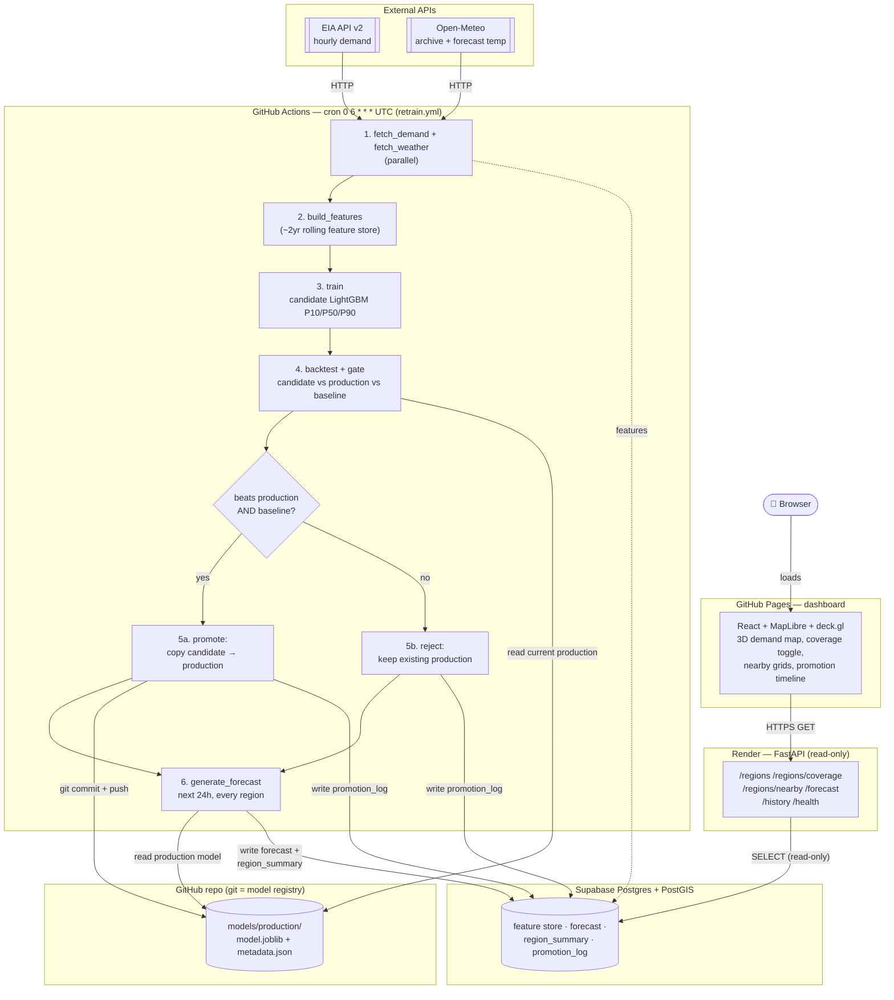

# ⚡ GridVision

An end-to-end MLOps system that forecasts US electricity demand: it pulls live
grid + weather data daily, retrains a LightGBM quantile model, gates any new
candidate against both the current production model and a naive baseline
before promoting it, and serves the result to a 3D geospatial dashboard.

**Live:**
- Dashboard: https://jeffreyblay.github.io/energy_demand_mlops/
- API: https://gridvision-api.onrender.com/health

*(Render's free tier sleeps after inactivity — the API may take ~30–60s to wake up on first request.)*

---

## How it works



No always-on server runs the pipeline — **GitHub Actions' cron trigger is the
scheduler**, standing in for what would otherwise be an Airflow instance that
has to stay up 24/7. Since each Actions run starts from a clean, ephemeral
checkout with no memory of yesterday's state, the "model registry" is the
**git repo itself**: a promoted model's weights and metadata are committed
straight into `models/production/`, so next run's checkout already has it.

Full diagram set (use case, activity, component, class, sequence, state
machine, deployment) lives in [`diagram/uml.md`](diagram/uml.md).

---

## Why these choices

- **LightGBM, not a neural net** — demand forecasting here is tabular
  regression with strong lagged/calendar features; gradient boosting wins on
  data of this size and shape, trains in seconds (matters for daily
  retraining), and supports quantile loss natively for the P10/P50/P90
  intervals the dashboard needs.
- **Double promotion gate** — a candidate is only promoted if it beats *both*
  the current production model *and* a seasonal-naive baseline
  (`demand_lag_168h`) on the same rolling 7-day holdout. Beating a bad
  production model isn't enough; it also has to beat a real benchmark. Pure,
  deterministic, unit-tested in isolation (`tests/test_promote.py`).
- **Git as the model registry** — no MLflow server to keep alive between
  ephemeral CI runs. The production model is a small file, versioned and
  audit-tracked by git history like everything else in the repo.
- **PostGIS for spatial queries** — grid coverage buffers (`/regions/coverage`)
  and "which grids are nearby" (`/regions/nearby`) are one `ST_Buffer` /
  `ST_DWithin` query each, not client-side geometry math.
- **FastAPI never recomputes** — it only reads what the pipeline already
  wrote to Postgres. Forecasting is scheduled and batch; serving is cheap and
  fast.

---

## Stack

| Layer | Tech |
|---|---|
| Orchestration (live) | GitHub Actions (cron) |
| Orchestration (local dev) | Apache Airflow via Docker Compose |
| Model | LightGBM, quantile regression (P10/P50/P90) |
| Model registry | Git-committed (`models/production/`) — MLflow used locally only |
| Database | Postgres + PostGIS (Supabase, hosted; local Docker for dev) |
| API | FastAPI, read-only |
| Dashboard | React + TypeScript, MapLibre GL JS + deck.gl |
| Hosting | Render (API) + GitHub Pages (dashboard) |
| Data sources | EIA API v2 (demand), Open-Meteo (weather, no key needed) |

9 US balancing authorities: ERCOT, MISO, PJM, NYISO, ISO-NE, SWPP (Southwest
Power Pool), CAISO, PacifiCorp West, PacifiCorp East.

---

## Local development

Full stack, mirrors what runs in CI/production but with local infra:

```bash
docker compose up -d              # Airflow, MLflow, local Postgres
conda activate gridMlops
uvicorn api.main:app --reload --port 8000

cd dashboard
npm install
npm run dev
```

- Airflow UI: http://localhost:8080
- MLflow UI: http://localhost:5000
- API: http://localhost:8000
- Dashboard: http://localhost:5173

Run the pipeline standalone (no Airflow) the same way GitHub Actions does:

```bash
python scripts/run_pipeline.py
```

Requires `EIA_API_KEY` and `POSTGRES_DSN` in `.env` (see `.env.example`).

---

## Repo map

```
src/                  pipeline modules (fetch, features, train, gate, forecast, model store)
scripts/run_pipeline.py   GitHub Actions entrypoint (sequential, no Airflow)
dags/                 Airflow DAG — local dev only, same logic as scripts/run_pipeline.py
api/                  FastAPI serving layer
dashboard/            React + MapLibre + deck.gl frontend
diagram/uml.md         full UML diagram set
.github/workflows/    retrain.yml (daily cron) + deploy-dashboard.yml
tests/                unit tests (promotion gate logic)
```
