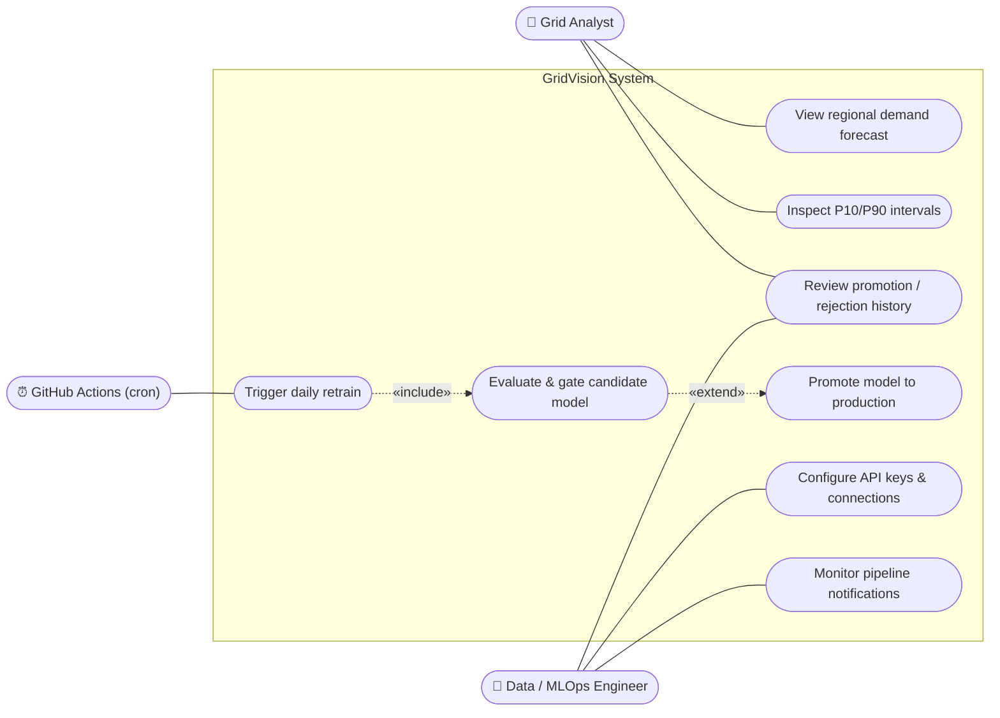
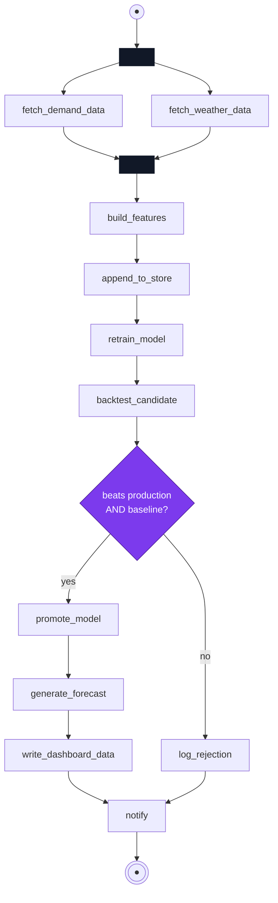
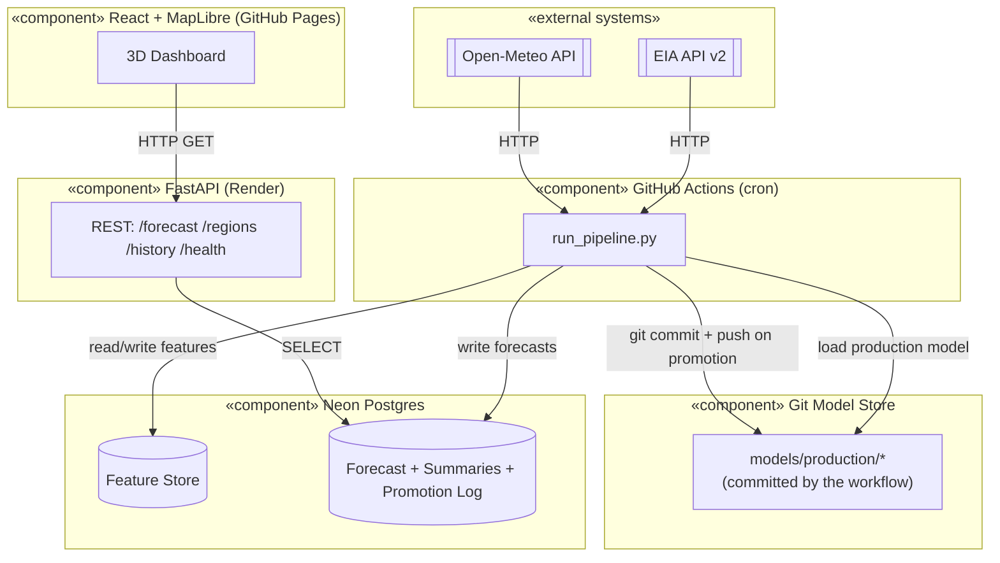
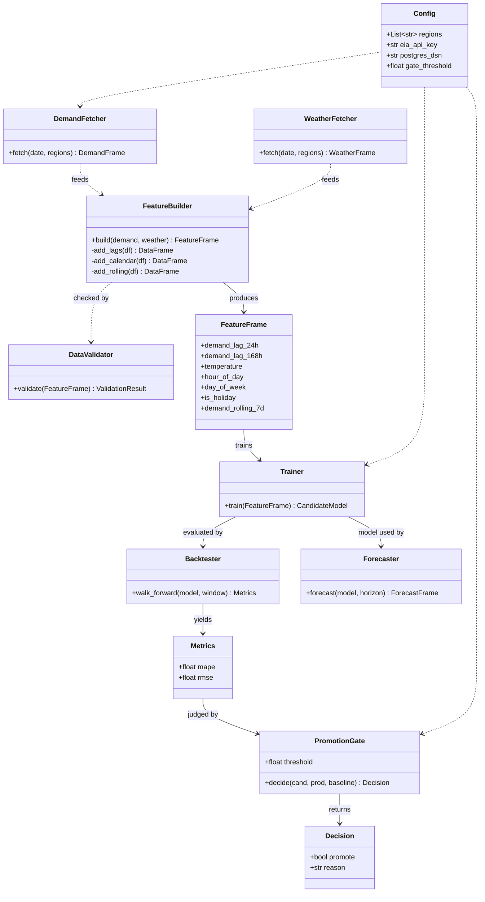
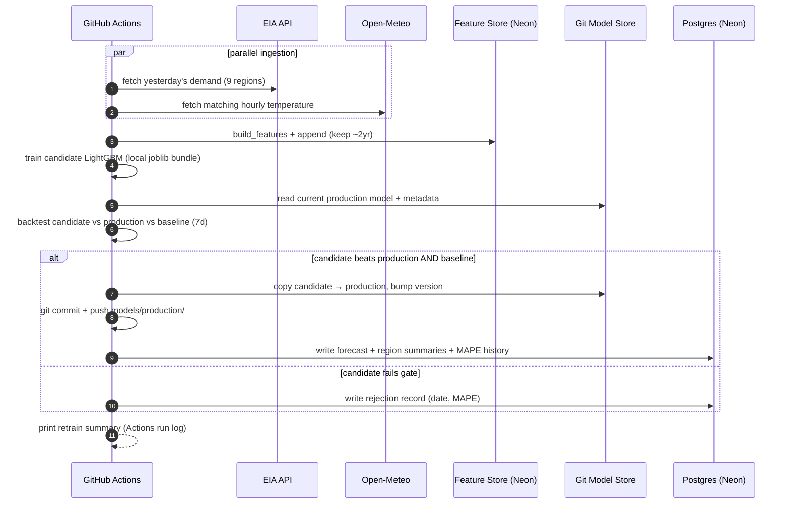
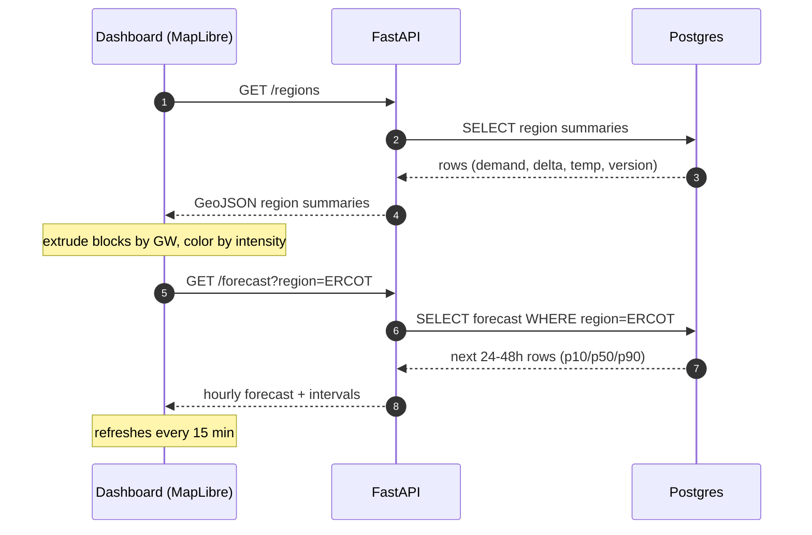
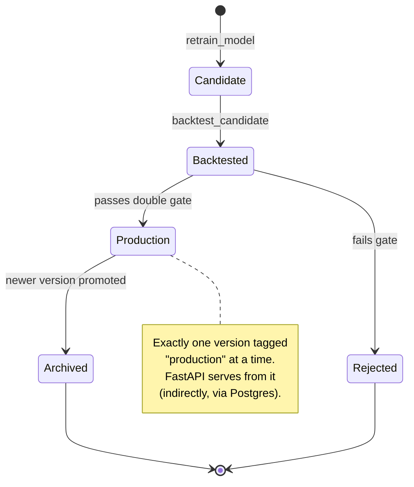
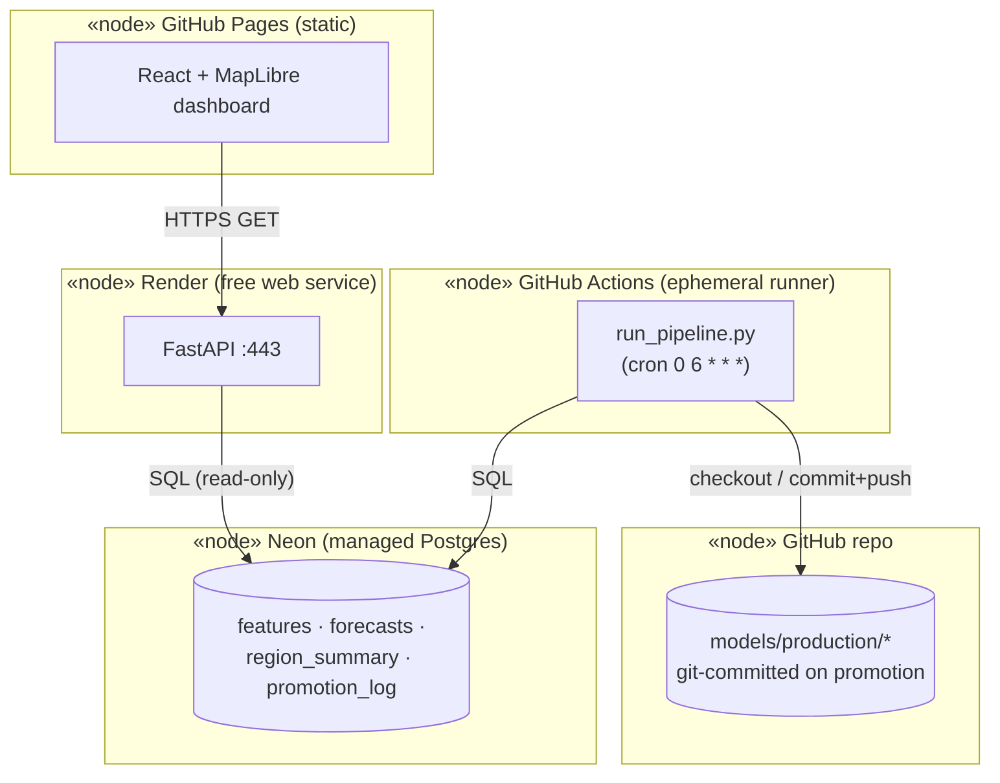
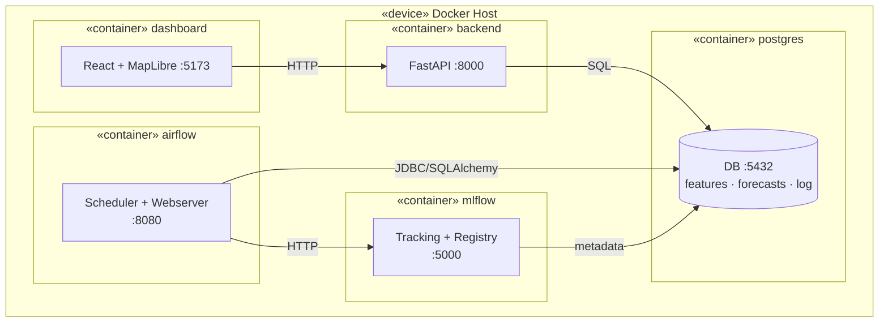

# ⚡ GridVision — UML Diagrams (Mermaid)

Unified Modeling Language views of the GridVision energy-demand MLOps pipeline.
Every fenced ` ```mermaid ` block below is **self-contained** — copy one block
at a time into [mermaid.live](https://mermaid.live) to render/export it.

UML diagrams included (structural + behavioral):

| # | UML diagram | Kind | Answers |
|---|---|---|---|
| 1 | [Use Case](#1-use-case-diagram) | behavioral | Who uses the system and for what |
| 2 | [Activity](#2-activity-diagram--daily-retrain-workflow) | behavioral | The workflow / control flow of the DAG |
| 3 | [Component](#3-component-diagram) | structural | How the services fit together |
| 4 | [Class](#4-class-diagram) | structural | The pipeline objects and their relations |
| 5 | [Sequence — retrain](#5-sequence-diagram--daily-retrain) | behavioral | Message order during a scheduled run |
| 6 | [Sequence — serving](#6-sequence-diagram--forecast-serving) | behavioral | Message order on an API request |
| 7 | [State Machine](#7-state-machine-diagram--model-lifecycle) | behavioral | Lifecycle of a model version |
| 8 | [Deployment](#8-deployment-diagram) | structural | Runtime nodes / Docker topology |

---

## 1. Use Case Diagram

Actors and the use cases the system exposes. (Mermaid has no native use-case
type; this is the conventional flowchart rendering — actors on the sides, use
cases as ovals inside the system boundary.)



---

## 2. Activity Diagram — daily retrain workflow

The control flow of `demand_retrain_dag`, in UML activity notation: filled
initial node, a **fork/join** for the parallel ingestion, a decision diamond for
the gate, and a final node. This is the "workflow" view.



> The two `[" "]` bars are the UML fork (split to parallel ingestion) and join
> (synchronize before feature build).

---

## 3. Component Diagram

Structural view of the deployable components and the interfaces between them.



---

## 4. Class Diagram

Domain and pipeline objects, their operations, and relationships. (Conceptual —
refine as Phase 1 code lands.)



---

## 5. Sequence Diagram — daily retrain

Message order between the scheduler, external APIs, the git model store, and
Postgres for one scheduled run.



---

## 6. Sequence Diagram — forecast serving

`GET /forecast?region=ERCOT`. The API only reads pre-computed forecasts — it
never recomputes on request.



---

## 7. State Machine Diagram — model lifecycle

Lifecycle of a single model version in the git-committed model store
(`models/production/`).



---

## 8. Deployment Diagram

**Live deployment** — no VM. Four independent, free-tier nodes; GitHub itself
is both the CI runner and the model's persistence layer (git).



**Local dev / demo** — the Docker Compose stack (unchanged, still useful for
showing the Airflow skill locally; not what drives the live deployment above).



---

*UML planning artifact for GridVision. Each block renders standalone on
mermaid.live — keep them in sync with the implementation as it evolves.*
